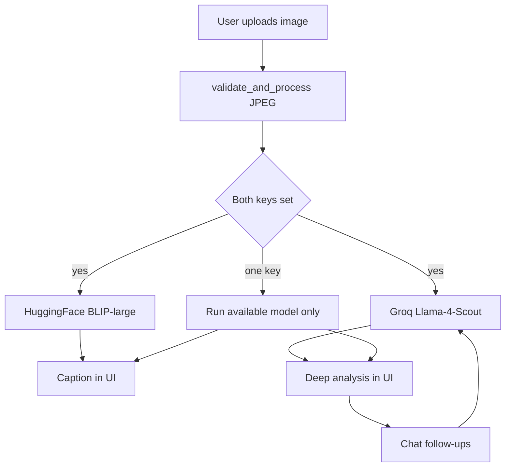

# VisualMind AI — Dual-Model Visual Intelligence

**VisualMind AI** is a Streamlit application that combines **Hugging Face BLIP-large** (open-source image captioning via the Inference API) with **Meta Llama 4 Scout** on **Groq** (multimodal vision + language) for rich image understanding and conversational visual Q&A.

Users upload an image; both models contribute complementary signals—fast captioning plus deeper scene analysis—then users can ask follow-up questions grounded in the same image.

---

## Architecture

```
User uploads image
       ↓ (validate + resize)
       ↓ (parallel when both API keys are set)
  ┌────────────────────┐    ┌──────────────────────────────┐
  │ HuggingFace BLIP   │    │ Groq Llama 4 Scout (vision) │
  │ Inference API      │    │ Deep analysis + Q&A           │
  │ Fast caption        │    │ Conversational memory       │
  └────────────────────┘    └──────────────────────────────┘
       ↓                          ↓
  Caption displayed         Analysis displayed
                                   ↓
              Follow-up Q&A (Llama 4 Scout with history)
```



---

## Use cases

| Area | Examples |
|------|----------|
| **E-commerce** | Product tagging, quality checks, listing copy |
| **Accessibility** | Alt-text drafts, screen-reader-friendly descriptions |
| **Content moderation** | Quick scene understanding (always pair with human review) |
| **Research** | Charts, slides, document screenshots, scene Q&A |

---

## Tech stack

- Python 3.11+
- [Streamlit](https://streamlit.io/)
- [Groq API](https://console.groq.com/) — `meta-llama/llama-4-scout-17b-16e-instruct`
- [Hugging Face Inference API](https://huggingface.co/docs/api-inference) — `Salesforce/blip-image-captioning-large`
- [Pillow](https://python-pillow.org/) — validation, resize, JPEG normalization

---

## Prerequisites (free tier)

You need **two free API credentials** (no credit card for typical Groq + HF token flows; always check each provider’s latest terms):

1. **Groq API key** — [console.groq.com](https://console.groq.com) → **API Keys** → create a key. Free tier includes generous daily limits (see Groq docs for current caps).
2. **Hugging Face token** — [huggingface.co/settings/tokens](https://huggingface.co/settings/tokens) → create a token that can call **Inference Providers** / serverless inference. For **fine-grained** tokens, enable **Inference** (or “Make calls to Inference Providers”); **Classic** tokens with Hub read often work for inference as well. If you see a **403** about permissions, regenerate the token with inference enabled.

---

## Local setup

```bash
cd "Visual Assistant AI"   # or your clone path
python -m venv .venv
.venv\Scripts\activate       # Windows
# source .venv/bin/activate  # macOS / Linux

pip install -r requirements.txt
copy .env.example .env       # Windows
# cp .env.example .env      # macOS / Linux
```

Edit `.env`:

```env
GROQ_API_KEY=gsk_...
HF_TOKEN=hf_...
```

Run:

```bash
streamlit run app.py
```

Open the URL shown in the terminal, upload a JPEG or PNG, and confirm **BLIP caption** and **Llama 4 Scout analysis** both populate. Use the chat box for follow-up questions.

You can also paste keys in the **sidebar** at runtime (values are not written to disk).

---

## Hugging Face Spaces deployment

1. Create a new **Space** on [huggingface.co/spaces](https://huggingface.co/spaces).
2. Choose **Streamlit** as the SDK (or **Docker** if you prefer this repo’s `Dockerfile`).
3. Push this repository (or upload files) so the Space root contains `app.py`, `requirements.txt`, `models/`, and `utils/`.
4. Open the Space **Settings → Secrets and variables → Secrets** and add:
   - `GROQ_API_KEY` — your Groq key  
   - `HF_TOKEN` — your Hugging Face token  
5. Redeploy / wait for the build to finish, then open the Space URL.

> **Note:** For Streamlit Spaces, `load_dotenv()` reads a `.env` only if you add one to the repo (not recommended for secrets). Prefer **Space secrets**; Streamlit injects them as environment variables, which `os.getenv("GROQ_API_KEY")` and `os.getenv("HF_TOKEN")` already use in the sidebar defaults.

---

## Docker (optional)

```bash
docker build -t visualmind .
docker run -p 8501:8501 -e GROQ_API_KEY=... -e HF_TOKEN=... visualmind
```

Health check: `GET http://localhost:8501/_stcore/health`

---

## Project layout

```
.
├── app.py
├── models/
│   ├── __init__.py
│   ├── blip_model.py
│   └── groq_vision.py
├── utils/
│   ├── __init__.py
│   └── image_utils.py
├── .env.example
├── requirements.txt
├── Dockerfile
└── README.md
```

---

## License

Use subject to the licenses of Streamlit, Groq, Meta Llama, Hugging Face models, and your own deployment policies.
